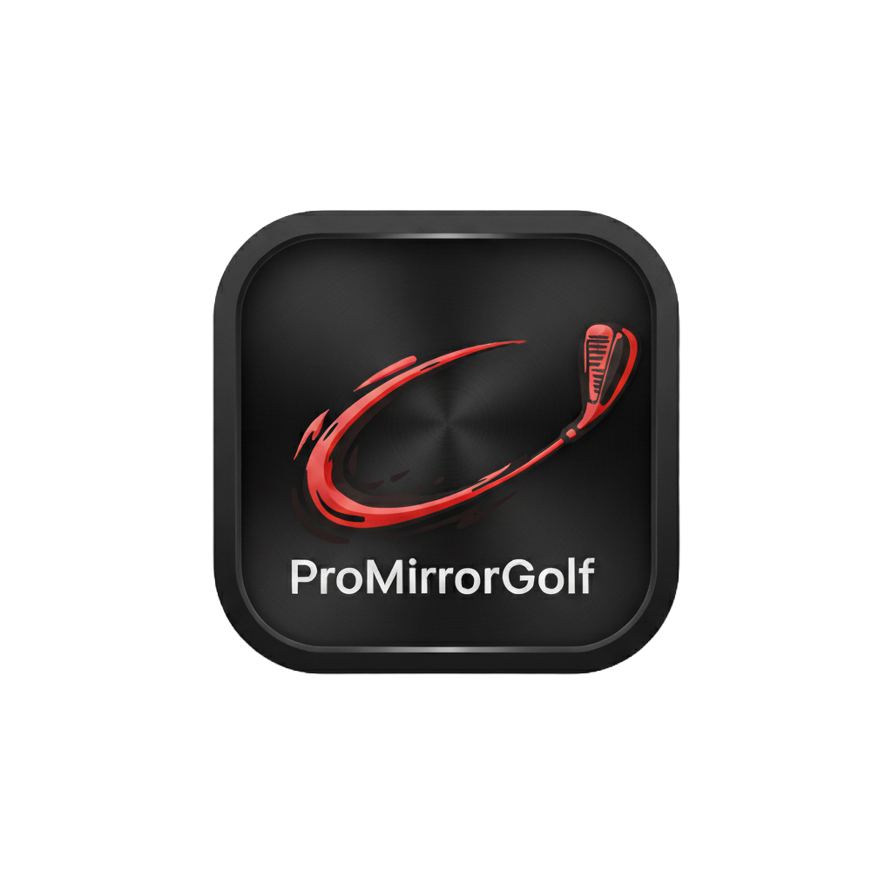

# ProMirrorGolf

**AI-Powered Golf Swing Analysis System**

 

Automated, real-time swing analysis that integrates with GSPro and your launch monitor. Hit a ball, get instant feedback with pro comparisons, 3D skeleton analysis, and personalized coaching recommendations.


---

## 🎯 Features

- ✅ **Zero-Input Automation** - Hit balls, get instant analysis (2-3 seconds)
- ✅ **Dual Camera Capture** - DTL + Face-on views with circular buffering
- ✅ **Launch Monitor Integration** - Rapsodo MLM2PRO via OpenGolfSim connector
- ✅ **AI Pose Analysis** - MediaPipe-based 3D skeletal tracking
- ✅ **Pro Comparison** - Automatic matching to professional swings
- ✅ **Flaw Detection** - ML-based swing diagnostics with recommendations
- ✅ **Side-by-Side Videos** - Compare your swing to matched pros
- ✅ **Historical Tracking** - Database of all swings for progress monitoring
- ✅ **Modern CustomTkinter UI** - Modular, responsive interface with real-time performance dashboard
- ✅ **Video Upload Support** - Process offline videos with quality modes (Speed/Balanced/Quality)
- ✅ **Performance Logging** - Comprehensive metrics tracking and CSV export
- ✅ **Mobile API** - REST endpoints for companion apps

---

## 📋 Requirements

### Hardware
- **PC**: Windows 10/11, Intel i5/AMD Ryzen 5 or better
- **GPU**: NVIDIA RTX 3070 (8GB VRAM) - *Recommended for RTX 3070*
- **RAM**: 16GB minimum, 32GB recommended
- **Cameras**: 2x USB webcams, 60fps minimum (120fps recommended)
- **Launch Monitor**: Rapsodo MLM2PRO

### Software
- Python 3.9+
- CUDA 11.8+ (for GPU acceleration)
- GSPro golf simulator
- MLM2PRO-OGS-Connector

---

## 🚀 Quick Start

### 1. Install Dependencies
```bash
pip install -r requirements.txt
```

### 2. Configure System

Edit `config.json` with your settings:
- Camera IDs (DTL and Face-on)
- MLM2PRO connector path
- GPU settings

### 3. Setup Pro Swings

Split dual-view videos:
```bash
python split_video.py "data/pro_videos/Justin_Thomas_DTLandFFO.mp4"
```

Import to database:
```bash
python import_pro_swing.py
```

### 4. Test Cameras
```bash
python test_cameras.py
```

### 5. Run Application
```bash
python main.py
```

---

## 📁 Project Structure
```
ProMirrorGolf/
│
├── main.py                 # Main application entry point (CustomTkinter UI)
├── config.json             # System configuration
├── requirements.txt        # Python dependencies
├── sanity_test.py          # Automated sanity test script
│
├── src/                    # Core source code
│   ├── swing_ai_core.py          # Main controller
│   ├── camera_manager.py         # Dual camera management
│   ├── mlm2pro_listener.py       # Launch monitor integration
│   ├── pose_analyzer.py          # AI pose estimation
│   ├── style_matcher.py          # Pro swing matching
│   ├── metrics_extractor.py      # Biomechanical metrics
│   ├── flaw_detector.py          # Swing flaw detection
│   ├── report_generator.py      # Report creation
│   ├── video_processor.py       # Video processing pipeline
│   ├── performance_logger.py    # Performance metrics logging
│   ├── mobile_api.py             # REST API for mobile apps
│   ├── database.py               # Data persistence
│   └── youtube_downloader.py     # Video downloader
│
├── ui/                     # Modular UI components (CustomTkinter)
│   ├── main_window.py            # Main application window
│   ├── top_bar.py                # Top navigation bar
│   ├── viewer_panel.py           # 3D skeleton viewer
│   ├── metrics_panel.py            # Swing metrics display
│   ├── controls_panel.py          # Playback and quality controls
│   ├── progress_panel.py          # Progress bar and status
│   ├── performance_dashboard.py   # Real-time performance metrics
│   └── dialogs.py                # File dialogs and message boxes
│
├── data/                   # Data storage
│   ├── pro_videos/               # Professional swing videos
│   ├── pro_swings.db             # Pro swing database
│   ├── swings.db                 # User swing database
│   ├── cache/                    # Frame cache
│   ├── exports/                  # Exported reports and videos
│   └── analytics/                # Analytics data
│
├── logs/                   # Log files
│   └── performance_log.csv       # Performance metrics log
│
├── tests/                  # Test files
│   ├── test_ui_modernization.py  # UI component tests
│   ├── test_stress_ui.py         # Stress tests
│   ├── test_e2e_swing_pipeline.py # End-to-end tests
│   └── test_cameras.py           # Camera tests
│
└── docs/                   # Documentation
    ├── README.md                 # This file
    ├── INSTALL.md                # Installation guide
    ├── RELEASE_CHECKLIST.md      # Release checklist
    ├── SANITY_TEST_PLAN.md       # Sanity test procedures
    ├── TEST_ASSESSMENT.md        # Test suite assessment
    ├── UI_MODERNIZATION_SUMMARY.md # UI modernization details
    └── ENHANCEMENT_SUMMARY.md    # Enhancement implementation summary
```

---

## 🚀 Production-Ready Features

### Performance Optimizations
- **<100ms Frame Processing**: Optimized pose detection with automatic frame resizing
- **GPU Acceleration**: Configurable GPU support for faster processing
- **Pro Swing Caching**: In-memory cache for instant pro matching (<10ms)
- **Vectorized Operations**: NumPy-optimized similarity calculations

### Video Upload Support
- **Offline Processing**: Upload DTL and Face-on videos for analysis
- **Auto-Synchronization**: Automatic frame alignment
- **Format Support**: MP4, AVI, MOV, MKV, WEBM
- **Same Pipeline**: Uses identical analysis as live camera mode

### MLM2Pro Integration
- **Automatic Detection**: Connects to MLM2Pro connector automatically
- **Shot Data Integration**: Real-time shot data from launch monitor
- **Connection Status**: Monitor connection and shot detection
- **Offline Fallback**: Estimates used if MLM2Pro unavailable
- **Video Upload Mode**: MLM2Pro automatically disabled in video upload mode (not needed)

### Analytics & Logging
- **Frame-Level Metrics**: Track processing time and pose quality
- **Swing History**: Complete analysis tracking
- **Flaw Evolution**: Track improvement over time
- **Export Options**: CSV and HTML dashboard exports

## 🎮 Usage

### Starting the Application

1. **Launch the application:**
   ```bash
   python main.py
   ```

2. **The UI will automatically:**
   - Initialize the backend `SwingAIController` in a separate async thread
   - Set up camera connections (if configured)
   - Connect to the database
   - Display the main interface with live backend integration

### Starting a Session

#### Live Camera Mode (Default)

1. **Click "New Analysis"** button in the top-right
2. The system will:
   - Initialize backend if not already done
   - Start camera buffering (capturing frames continuously)
   - Connect to MLM2Pro (if configured)
   - Create a new database session
   - Begin monitoring for swing detection
   - Set up swing detection callbacks
3. **Status indicator** (top-left) will turn green and show "Active"
4. **Start hitting balls** - the system will automatically detect and analyze swings

#### Video Upload Mode

**Important Notes:**
- MLM2Pro connector is **automatically disabled** in video upload mode
- Processing timeout is **10 minutes** (600 seconds) to handle long videos
- Frame count alignment is checked and warnings logged if videos differ
- Session stop is safe and handles timeouts gracefully

1. **Click "Upload Video"** button in the top-right

2. **Select videos**:
   - First: Select Down-the-Line (DTL) video
   - Second: Select Face-on video
   - Supported formats: MP4, AVI, MOV, MKV, WEBM

3. **Automatic processing**:
   - Videos validated (format, frame count, properties)
   - Frame alignment checked (warnings if mismatch)
   - Frames extracted and analyzed
   - Full pipeline executed (same as live mode)
   - Results saved to database
   - Progress logged every 100 frames

**Frame Alignment:**
- If DTL and Face videos have different frame counts, the system uses the shorter video length
- A warning is logged but processing continues
- For best results, ensure both videos have the same frame count

**Processing Time:**
- Depends on video length and frame rate
- Typical: 1-5 minutes for 30-60 second videos
- Timeout: 10 minutes maximum
- Progress updates in real-time via progress bar
- **Threaded Processing**: Frame processing runs in background thread, GUI remains responsive
- **Performance**: Average processing time logged per frame (target: <100ms)
- **Downsampling**: Use `downsample_factor` parameter to process every Nth frame for faster processing

**Progress Bar & Status:**
- Real-time progress bar shows processing percentage
- Status messages update during processing
- Frame counter shows current/total frames
- Average processing time per frame displayed
- Thread-safe updates using `root.after()` for GUI responsiveness

**Playback Controls:**
- After processing, use playback controls to review swing:
  - **Play/Pause** (►): Start/stop playback
  - **Rewind** (◄◄): Go to start
  - **Fast Forward** (►►): Go to end
  - **Frame Step** (◄ ►): Step frame-by-frame
  - **Timeline**: Click to jump to specific frame

**Overlay Differences:**
- Switch to "Overlay" view to see real-time comparison with pro swing
- Color-coded indicators:
  - **Green**: Small difference (<5°)
  - **Yellow**: Medium difference (5-15°)
  - **Red**: Large difference (>15°)
- Shows top 4 metric differences with directional arrows

### During Practice - Live Backend Integration

- **Automatic Detection**: System continuously monitors camera frames for swing motion
- **Real-time Analysis Pipeline**: When a swing is detected:
  1. **Pose Detection** → MediaPipe analyzes frames from both cameras
  2. **Metrics Extraction** → Calculates biomechanical metrics (hip rotation, shoulder turn, x-factor, etc.)
  3. **Flaw Detection** → Compares metrics to ideal ranges and identifies issues
  4. **Pro Matching** → Finds best matching professional swing based on style similarity
  5. **UI Update** → All data displayed in real-time with thread-safe updates

- **Live UI Updates**:
  - **Metrics Sidebar**: Updates with actual calculated values
    - Your metrics vs. matched pro metrics
    - Difference indicators (+/- values)
    - Color-coded status based on flaw severity (green=good, orange=warning, red=needs work)
  - **Recommendations Panel**: Shows top 3 flaws with specific coaching recommendations
  - **Pro Match Display**: Shows matched professional golfer and similarity score
  - **Swing Count**: Increments automatically
  - **Timeline**: Visual markers for each swing (color-coded by score)
  - **Status Bar**: Shows current activity and swing analysis results

- **Notifications**: Pop-up alerts show swing analysis results with overall score and key metrics

### Viewing Results

The UI displays live data from the backend:

- **Metrics Panel** (right sidebar):
  - **Hip Rotation** - Rotation at top of backswing (degrees)
  - **Shoulder Turn** - Shoulder rotation at top (degrees)
  - **X-Factor** - Shoulder-hip separation (degrees)
  - **Spine Angle** - Forward tilt at address (degrees)
  - **Tempo Ratio** - Backswing:downswing ratio
  - **Weight Shift** - Lateral weight transfer
  - Each metric shows:
    - Your value (from pose analysis)
    - Pro value (from matched professional)
    - Difference (your value - pro value)
    - Status indicator (color-coded)

- **Recommendations Panel**:
  - Top 3 priority areas to improve (sorted by severity)
  - Specific drill suggestions for each flaw
  - Personalized coaching tips based on your metrics

- **Pro Comparison**:
  - Matched professional golfer name
  - Similarity score (0-100%)
  - Automatic matching based on swing style

- **Swing Timeline**:
  - Visual markers for each swing in the session
  - Color-coded by overall score (green ≥80, orange ≥60, red <60)
  - Shows progression over the session

### Exporting Data

1. **Export Video**:
   - Click "Export Video" button
   - Requires a swing that has been analyzed
   - Retrieves video from database
   - Choose save location
   - Video file contains both DTL and face-on views (if available)

2. **Save HTML Report**:
   - Click "Save HTML" button
   - Requires a swing that has been analyzed
   - Uses backend `ReportGenerator` to create comprehensive report
   - Includes:
     - Overall score and flaw count
     - All metrics with pro comparisons
     - Shot data (club speed, ball speed, etc.)
     - Flaw analysis with recommendations
     - Matched pro information
   - Option to open in browser automatically

### After Session

- **Stop Session**: Session stops automatically when application closes, or can be stopped manually
- **All Data Saved**: Every swing is automatically saved to the database with:
  - Full metrics data
  - Flaw analysis
  - Pro match information
  - Shot data (if launch monitor connected)
- **Review Later**: All swings can be accessed from the database for historical analysis
- **Track Progress**: Compare swings over time to see improvement
- **Export Reports**: Generate HTML reports for any swing in the database

### UI Controls

**View Selection**:
- **Side**: Down-the-line view (default)
- **Front**: Face-on view
- **Top**: Bird's eye view
- **Overlay**: Side view with angle indicators
- Click any view button to switch perspectives instantly

**Pro Selection**:
- **Auto Match**: Automatically matches best pro based on swing style (default)
- **Manual Selection**: Choose any pro from dropdown menu
- Pro label shows similarity score for auto-matched pros
- Dropdown populated from database with all available pros

**Club Selection**:
- Full club selection: Driver, 3-Wood, 5-Wood, 3-9 Irons, PW, SW, LW, Putter
- Changing club automatically re-matches pro (if swing data available)
- Club type affects pro matching algorithm

**Playback Controls**:
- **◄◄**: Rewind to start
- **►**: Play/Pause (video playback coming soon)
- **►►**: Fast forward to end
- **⟲**: Reset to swing start

---

## 🧪 Testing

### End-to-End Test Suite

Run the comprehensive test suite:

```bash
python test_e2e_swing_pipeline.py
```

**Test Coverage**:
- Pose detection from video frames
- Metrics extraction from pose data
- Flaw detection and recommendations
- Pro swing matching
- Full pipeline end-to-end
- Session management
- Export functionality
- Edge cases (empty data, missing frames, etc.)

**Expected Output**:
- All 8 tests pass
- Detailed logging of each test
- Validation of metrics, flaws, and pro matches
- Exit code 0 (success) or 1 (failure)

See `TEST_DOCUMENTATION.md` for detailed test documentation.

---

## ⚙️ Configuration

### config.json
```json
{
  "cameras": {
    "dtl_id": 2,
    "face_id": 0,
    "fps": 60,
    "resolution": [1920, 1080]
  },
  "mlm2pro": {
    "connector_path": "D:\\ProMirrorGolf\\MLM2PRO-OGS-Connector\\connector.exe"
  },
  "ai": {
    "use_gpu": true
  }
}
```

### Camera Setup

- **DTL Camera (Down-the-line)**: Behind golfer, looking at target
- **Face Camera (Face-on)**: In front of golfer, 90° from target line
- Both should be at hip height, 10-15 feet away

---

## 🔧 Utilities

### split_video.py
Automatically detects and splits dual-view videos:
```bash
python split_video.py "path/to/video.mp4"
```

### import_pro_swing.py
Import professional swings to database:
```bash
python import_pro_swing.py
# Follow interactive prompts
```

### test_cameras.py
Test and preview cameras:
```bash
python test_cameras.py
# Shows all available cameras with live preview
```

---

## 📊 Swing Metrics

The system analyzes:

- **Hip Rotation** (35-50° ideal)
- **Shoulder Rotation** (80-110° ideal)
- **X-Factor** (shoulder-hip separation, 35-55° ideal)
- **Spine Angle** (maintenance through impact)
- **Weight Transfer** (lateral shift)
- **Tempo Ratio** (backswing:downswing, 2.5-3.5 ideal)
- **Club Speed** (from launch monitor)
- **Ball Speed** (from launch monitor)
- **Launch Angle** (from launch monitor)
- **Spin Rate** (from launch monitor)

---

## 🐛 Troubleshooting

### Cameras Not Detected
```bash
python test_cameras.py
# Check device IDs and update config.json
```

### MLM2PRO Connection Issues
1. Verify Bluetooth connection
2. Check connector path in config.json
3. Test with GSPro first

### Slow Processing
- Lower camera resolution in config.json
- Reduce FPS to 60
- Close other GPU applications
- Verify CUDA installation: `nvidia-smi`

### Import Errors
```bash
# Reinstall dependencies
pip install --force-reinstall -r requirements.txt
```

---

## 📈 Roadmap

### Version 2.0 (Current) ✅
- ✅ Dual camera capture
- ✅ MLM2PRO integration
- ✅ AI pose analysis
- ✅ Pro matching
- ✅ Flaw detection
- ✅ Modern CustomTkinter UI
- ✅ Video upload support
- ✅ Performance dashboard
- ✅ Performance logging
- ✅ Mobile API (REST endpoints)
- ✅ Batch processing
- ✅ Enhanced export features

### Planned (Future)
- 🔲 Real-time 3D avatar
- 🔲 Mobile companion app (UI)
- 🔲 Cloud sync
- 🔲 Drill recommendations
- 🔲 Progress charts
- 🔲 Advanced analytics dashboard

---

## 🤝 Contributing

Contributions welcome! Please:
1. Fork the repository
2. Create a feature branch
3. Make your changes
4. Submit a pull request

---

## 📄 License

MIT License - see LICENSE file for details

---

## 💬 Support

- **Issues**: [GitHub Issues](https://github.com/alonsom3/ProMirrorGolf/issues)
- **Discussions**: [GitHub Discussions](https://github.com/alonsom3/ProMirrorGolf/discussions)

---

## 🙏 Acknowledgments

- MediaPipe (Google) for pose estimation
- OpenGolfSim community for MLM2PRO connector
- All professional golfers whose swings we study

---

**Made with ⛳ by golfers, for golfers**

*For best results, practice with purpose. ProMirrorGolf shows you what to work on, but you still have to do the work!*
